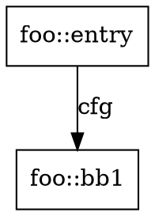

# LLVM IR CFG / Call Graph Extractor

这是一个基于 `LLVM 10` 的最小分析框架，用来从 `.ll` 或 `.bc` 中提取：

- `static.json` 兼容格式的函数表和基本块表
- 函数级 `CFG`
- 模块级 `Call Graph`

当前输出结构对齐：

- `/home/lab420/Desktop/autoframe/tracer/instrument`
- `~/Desktop/autoframe/benchmarks/libxml/static/static.json`

当前实现先覆盖骨架能力，便于后续接入：

- LLVM IR 内的间接调用补全
- ICFG 构建
- SVF 指针分析补边
- 外部函数 summary

## 目录

```text
.
├── CMakeLists.txt
├── README.md
└── src
    └── main.cpp
```

## 构建

要求环境中有：

- `cmake`
- `clang++-10`
- `llvm-config-10`

构建命令：

```bash
mkdir -p build
cd build
cmake -DLLVM_DIR=$(llvm-config-10 --prefix)/lib/cmake/llvm ..
make -j
```

生成可执行文件：

```bash
build/ir_graph_extractor
```

## 用法

### 1. 直接分析 `.ll`

```bash
build/ir_graph_extractor ../input.ll -o ../output
```

### 2. 直接分析 `.bc`

```bash
build/ir_graph_extractor ../input.bc -o ../output
```

## 使用 gllvm 收集 bitcode

如果你的目标程序是一个普通 C/C++ 项目，可以先用 `gllvm` 编译出二进制，再抽取 bitcode：

```bash
export LLVM_COMPILER=clang
CC=gclang CXX=gclang++ ./configure
make -j
get-bc ./your_binary
```

然后分析生成的 bitcode：

```bash
build/ir_graph_extractor ./your_binary.bc -o ./output
```

如果你要尽量保留调用关系，建议构建目标程序时优先使用：

```bash
-O0 -g -fno-discard-value-names
```

必要时可以进一步禁用内联：

```bash
-fno-inline
```

## 输出说明

### 1. `output/static.json`

结构与参考实现一致，包含两张表：

- `functions`
- `basic_blocks`

其中：

- `functions[*].calls` 是直接调用目标 ID
- `functions[*].refs` 是静态上可恢复的间接引用/候选目标 ID
- `basic_blocks[*].calls` 是当前基本块中的直接调用目标 ID
- `basic_blocks[*].successors` 是 CFG 后继基本块 ID

当前的间接调用补全覆盖这些 IR 模式：

- `bitcast` / `alias` / `gep`
- `phi` / `select`
- 从 `global` / `alloca` / `load` 恢复函数指针
- 函数参数中的回调透传

### 2. `output/cfg/*.dot`

每个函数一个 DOT 文件，节点是基本块，边是控制流边。

示例：



### 3. `output/callgraph.dot`

模块级调用图。

边标签当前支持：

- `call`
- `ref`

## 当前框架的限制

当前版本故意保持最小实现，因此有这些限制：

1. `refs` 仍然是轻量候选集，不是完整 points-to 结果
2. CFG 只到函数内，不包含调用边和返回边
3. 外部库调用没有 summary 建模
4. 没有上下文敏感分析

## 推荐的下一步

如果你要解决“调用链不完整”，建议按这个顺序扩展：

1. 输出 `must-call` / `may-call` / `unresolved`
2. 在 CFG 基础上构建 `ICFG`
3. 接入 `SVF` 的 pointer analysis 结果补边
4. 对 `pthread_create`、回调注册函数、`dlsym` 等做 summary
